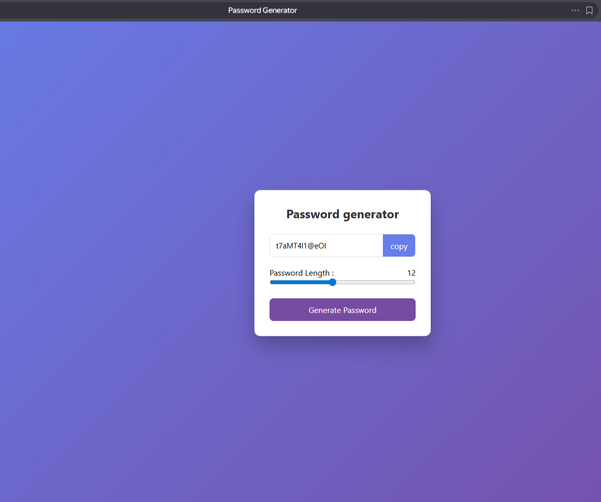

# Password Generator

#### Простое и эффективное веб-приложение для создания надежных случайных паролей. Проект выполнен на чистом стеке (Vanilla JS) с акцентом на удобство пользователя и современный интерфейс.

# Стек технологий

#### HTML5: Семантическая структура документа.
#### CSS3: Использование Flexbox для центрирования, создание кастомных UI-элементов и градиентов.
#### JavaScript (ES6+): * Работа с DOM-деревом (EventListener). 

# Основной функционал
#### Динамическая настройка длины: Пользователь может выбрать длину пароля от 6 до 20 символов с помощью ползунка (range input).
#### Генерация в один клик: Создание пароля, включающего заглавные и строчные буквы, цифры и специальные символы.
#### Копирование в буфер обмена: Интеграция с Clipboard API для быстрого копирования пароля.
#### Адаптивный UI: Приятный дизайн с использованием градиентов и теней, полностью корректно отображающийся на разных устройствах.

# Структура проекта
#### index.html — разметка приложения.
#### style.css — стилизация и визуальные эффекты.
#### script.js — логика генерации пароля и работа с событиями.

# Установка и запуск

#### 1.Клонируйте репозиторий:
#### 2.Откройте файл index.html в любом современном браузере.

# Результат 

